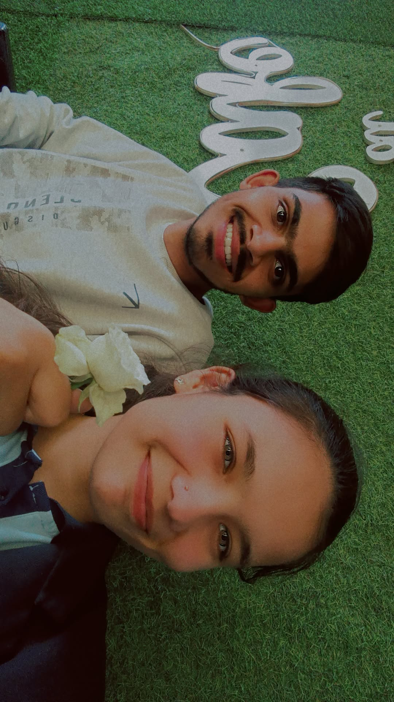

<!DOCTYPE html>
<html lang="en">
<head>
  <meta charset="UTF-8">
  <meta name="viewport" content="width=device-width, initial-scale=1.0">
  <title>Happy Birthday My Love</title>
  
</head>
<body>

<!-- Welcome Screen -->

  <h1>Happy Birthday My Love!!!💗</h1>
  
Tap to begin your memorable journey 🫂❤️

  <button class="button" onclick="showPoem()">Let's Begin 🥹</button>

<!-- Poem Page -->

  <h1>Happy Birthday Mine!!!❤️🌎</h1>
  
You grow like a river, calm yet strong, 
     Carving dreams, singing life's song. 
     You shine like the stars in the endless sky, 
     Lighting my world, lifting me high.

  
I hope we stay together like roots and tree, 
     Bound by love, wild and free. 
     Today and forever, come what may, 
     I choose you more with every day.

  
<strong>Happy Birthday My Forever Home 🫀🧿</strong>

  <button class="button" onclick="startSlideshow()">Start Our 4-Year Journey</button>

<!-- Slideshow Page -->

  <audio id="bg-music" autoplay loop>
    <source src="ye-tune-kya-kiya.mp3" type="audio/mpeg">
    Your browser does not support the audio element.
  </audio>

  <!-- Photo Slide 1 -->
  

    
    
"Year 1: From friendship’s first spark, you lit up my dark."

  

  <!-- Photo Slide 2 -->
  

    
    
"Year 2: Laughter, late nights, and dreams we drew.🫀🫂"

  

  <!-- Photo Slide 3 -->
  

    
    
"Year 3: Weathered storms, held each other true.🫂"

  

  <!-- Photo Slide 4 -->
  

    
    
"Year 4: From smiles to memories that feel brand new.❤️"

  

  <!-- Photo Slide 5 -->
  

    
    
"New beginnings, side by side, together we thrive 😌🫂."

  

  <!-- Photo Slide 6 -->
  

    
    
"In every laugh, in every tear, you've been my guiding light.💗😚"

  

  <!-- Photo Slide 7 -->
  

    
    
"No distance too far, no hurdle too tall, your love conquers it all.🧿🫂"

  

  <!-- Photo Slide 8 -->
  

    
    
"With you, the world feels just right, you’re my moonlight.🌝🫂"

  

  <!-- Photo Slide 9 -->
  

    
    
"Through thick and thin, I’ll always stand by you.❤️🤝🏻"

  

  <!-- Photo Slide 10 -->
  

    
    
"Here's to forever, one moment at a time 🌎🫀"

  

  <!-- Video Slide -->

  <video controls width="100%" height="auto">
    <source src="video1.mp4" type="video/mp4">
    Your browser does not support the video tag.
  </video>
  
"Our beautiful journey, captured in time, every moment sublime."

</body>
</html>
